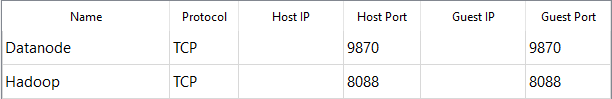

# Workspace configuration: Hadoop Cluster Multinode with VirtualBox and Ubuntu Server
### Virtual Box Configuration
1. Install Ubuntu Server on a Virtual Machine for `Master` and clone this for nodes `Worker`.
2.  In network configuration of the `Master` VM set two adapters NAT and Internal Network. In NAT expand advanced options and select Port Forwarding. Add two rules for the connection with admin-panel of Hadoop



3. Adition for connection with SSH from PowerShell


`> ssh username_ubuntu@localhost`

### Ubuntu Configuration
1. Change hostname
    ```
    sudo nano /etc/hostname 
    sudo nano /etc/hosts
    sudo reboot
    ```
2. Enable interface `enp0s8`
    ```
    sudo ifconfig enp0s8 up
    ```
3. Edit file `sudo cat /etc/netplan/00-installer-config.yaml`
    ```
    network:
        ethernets:
            enp0s3:
                dhcp4: true
            enp0s8:::
                dhcp4: false
                addresses:
                    - 192.168.0.3/24
    ```
### Hadoop Cluster Configuration
1. Edit core-site.xml file `sudo nano $HADOOP_HOME/etc/hadoop/core-site.xml`
    ```html
    <configuration>
        <property>
                <name>fs.default.name</name>
                <value>hdfs://master:9000</value>
        </property>
    </configuration>
    ```
2. Edit hdfs-site.xml file `sudo nano $HADOOP_HOME/etc/hadoop/hdfs-site.xml`
    ```html
    <configuration>
        <property>
                <name>dfs.namenode.data.dir</name>
                <value>/usr/local/hadoop_tmp/hdfs/namenode</value>
        </property>
        <property>
                <name>dfs.datanode.data.dir</name>
                <value>/usr/local/hadoop_tmp/hdfs/datanode</value>
        </property>
        <property>
                <name>dfs.replication</name><value>2</value>
        </property>
    </configuration>
    ```
3. Edit mapred-site.xml file `sudo nano $HADOOP_HOME/etc/hadoop/mapred-site.xml`
    ```html
    <configuration>
        <property>
                <name>mapreduce.job.tracker</name>
                <value>master:5431</value>
        </property>
        <property>
                <name>mapreduce.framework.name</name>
                <value>yarn</value>
        </property>
    </configuration>
    ```

4. Edit yarn-site.xml file `sudo nano $HADOOP_HOME/etc/hadoop/yarn-site.xml`
    ```html
    <configuration>
        <property>
                <name>yarn.nodemanager.aux-services</name>
                <value>mapreduce_shuffle</value>
        </property>
        <property>
                <name>yarn.nodemanager.aux-services.mapreduce.shuffle.class</name>
                <value>org.apache.hadoop.mapred.ShuffleHandler</value>
        </property>
        <property>
                <name>yarn.nodemanager.env-whitelist</name>
                <value>JAVA_HOME,HADOOP_COMMON_HOME,HADOOP_HDFS_HOME,HADOOP_CONF_DIR,CLASSPATH_PERPEND_DISTCACHE,HADOOP></property>
        <property>
                <name>yarn.resourcemanager.resource-tracker.address</name>
                <value>master:8025</value>
        </property>
        <property>
                <name>yarn.resourcemanager.scheduler.address</name>
                <value>master:8035</value>
        </property>
        <property>
                <name>yarn.resourcemanager.address</name>
                <value>master:8050</value>
        </property>
    </configuration>
    ```